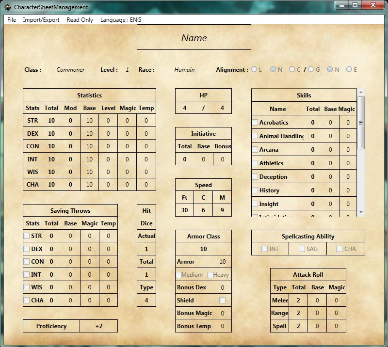

# CharacterSheetManagement
[ENG] An app to manage your characters, export them and import them. (DataBase is actually disabled since it's not working without Visual Studio Community 2015 running). Any suggestions are appreciated (or bug reports !).

[FR] Une application pour gérer vos personnages, les exporter et les importer. (La base de donnée est actuellement désactivée puisqu'elle ne fonctionne pas si l'application n'est pas lancée via Visual Studio Community 2015). Toutes les suggestions et retours sont appréciés(de même si vous trouver des bugs !).

## Presentation
English Sample from Windows 7 Enterprise( ENG View ) :

On start Sample from Windows 7 Enterprise( Vue FR ) :

## Last Version Downloadable
[DownloadLink_v0.13](http://www.mediafire.com/file/mra2w2s63yvbky0/CharacterSheetManagement.exe "CSM v0.13")

## Requirements
Tested on : Windows 7 Enterprise, Windows 10, Windows 10 Insider.